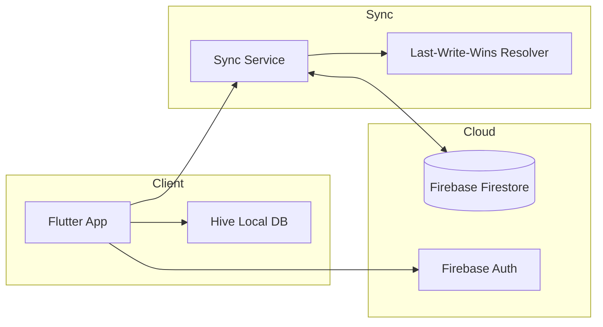

# PomodoroX — Architecture Overview

## Problem Statement
Knowledge workers need a lightweight focus timer that reinforces healthy work habits without complex project management overhead. Most timers lack clarity on usage patterns and do not support gentle habit-building.

## Target Users
- **Students**: structured study blocks and break reminders
- **Developers/Designers**: deep work cycles with minimal distractions
- **Remote Teams**: shared focus conventions and simple reporting

## Core Features (MVP)
- Pomodoro timer with configurable intervals
- Session history and streaks
- Gentle notifications and break prompts
- Simple focus analytics (daily/weekly summaries)
- Offline-first persistence with optional cloud sync

## High-Level Architecture
**Text Summary**: A Flutter client follows MVVM with Hive for offline-first persistence. Firebase provides optional sync for signed-in users. Analytics are computed from local data with cloud reconciliation when available.

## Data Model (Simplified)
- **UserProfile**: user_id, name, timezone, notification_prefs, timer_prefs
- **Goal**: id, description, cycles_target, cycles_completed, status
- **TimerState**: goal_id, phase, remaining_seconds, last_saved_at
- **SessionLog**: id, start_at, end_at, mode (focus/break), duration

## Deployment Flow
1. **Client**: Flutter builds for Android, iOS, and web.
2. **Firebase**: Auth + Firestore for optional sync.
3. **Offline-first**: app runs without cloud credentials.
4. **Observability**: error tracking + basic performance metrics.

## Tradeoffs & Constraints
- **Analytics scope**: lightweight summaries to keep the product simple.
- **Offline-first**: local sessions cached; sync on reconnect.
- **Privacy**: minimal data collection, no content tracking.

## Delivery Management & QA Evidence
- **Release management** with version tracking and standardized release templates.
- **Planning discipline** using structured feature plans with acceptance criteria.
- **Quality gates** emphasizing analysis, tests, and manual validation.
- **Documentation index** for discoverability across guides, plans, testing, and implementation summaries.

## Issues Encountered & Resolutions (Non‑Proprietary)
- **Timer state persistence** across restarts → Hive‑backed persistence with periodic saves.
- **Sync conflict handling** → last‑write‑wins with explicit metadata tracking.
- **Analytics expansion risk** → on‑demand calculations and lazy loading to protect performance.
- **Release consistency** → standardized templates, checklists, and rollback steps.

## AI vs Human Decisions
**Human-led**
- Product positioning and habit-building mechanics
- Minimal data model and privacy boundaries
- Notification cadence and UX constraints

**AI-assisted**
- Drafting non-sensitive documentation and diagrams
- Generating scaffolding for analytics queries (reviewed)

## Reference Repository
- https://github.com/MotoLogic-Systems/pomodoroX

---

*This document is a clean-room architecture summary with no proprietary code.*
